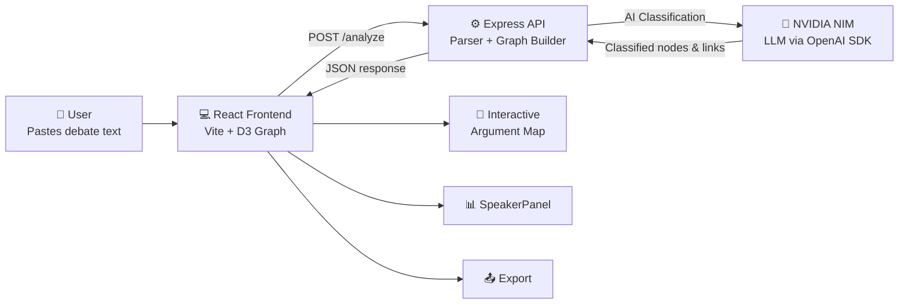

<div align="center">

# 🗣️ Argument Replay Engine

**AI-powered debate analysis that turns noisy discussion threads into animated claim maps, relationship summaries, and report-ready insight panels.**

[](https://github.com/sudharshan994/Argument-Replay-Engine/actions/workflows/ci.yml)
[](LICENSE)
[](https://react.dev)
[](https://expressjs.com)
[](https://d3js.org)
[](https://build.nvidia.com)

[Live Demo](https://your-deployment-url)

</div>

---

## 🎬 Demo
Add GIF here

---

## 📖 Table of Contents

- [Why It Matters](#why-it-matters)
- [New Features](#new-features)
- [Architecture](#architecture)
- [Tech Stack](#tech-stack)
- [Getting Started](#getting-started)
- [API Reference](#api-reference)
- [Contributing](#contributing)
- [License](#license)

---

## 💡 Why It Matters

Online debates are usually hard to review because claims, counterclaims, questions, and repeated points are mixed together. **Argument Replay Engine** parses a pasted thread, extracts the logical propositions, groups duplicate claims, evaluates argument strength, and replays the conversation as an interactive anti-gravity graph.

This project demonstrates **full-stack engineering** with **AI integration**: React frontend, Express backend, NLP-based classification, and D3 graph visualization — all tied together with CI/CD.

---

## ✨ New Features

| Feature | Description |
|---------|-------------|
| 🕒 **Replay Mode** | Step-by-step timeline slider to watch arguments unfold chronologically with smooth D3 transitions. |
| 🛡️ **Argument Strength Score** | AI evaluates claims (0-100), detecting logical fallacies (e.g., "Ad hominem"). Visualized via node rings. |
| 👤 **Speaker Stance Summary** | Breakdowns per participant showing claims, attacks, agreements, and average strength scores. |
| 📤 **Export Functionality** | One-click export of the D3 canvas (PNG), graph data (JSON), and shareable clipboard summaries. |
| 🌗 **Dark / Light Theme** | Persistent theme toggle built with TailwindCSS. |
| 📚 **Sample Debate Presets** | One-click loadable debates ("Climate change", "AI ethics", "Vaccine policy") for instant testing. |
| 🌌 **Anti-Gravity Layout** | A custom D3 force simulation featuring node mass, particle trails, distinct link styles, and repelling physics. |

---

## 🏗️ Architecture



---

## 💻 Tech Stack

| Layer | Technology |
|-------|------------|
| **Frontend** | React 19, Vite 8, D3.js 7, TailwindCSS 4 |
| **Backend** | Express 5, Node.js |
| **AI/ML** | NVIDIA NIM (via OpenAI-compatible SDK) |
| **Code Quality** | ESLint 10, Vitest |
| **CI/CD** | GitHub Actions |

---

## 🚀 Getting Started

### Prerequisites

- Node.js 20+ and npm
- NVIDIA NIM API key ([get one here](https://build.nvidia.com))

### 1. Clone the repository

```bash
git clone https://github.com/sudharshan994/Argument-Replay-Engine.git
cd Argument-Replay-Engine
```

### 2. Configure environment

```bash
cp .env.example .env
# Edit .env and add your NVIDIA_API_KEY
```

| Variable | Description |
|----------|-------------|
| `NVIDIA_API_KEY` | Your NVIDIA NIM API key |
| `VITE_API_URL` | Backend URL (default: `http://localhost:3001`) |

### 3. Install & Run

We use `concurrently` to run both the frontend and backend with a single command.

```bash
npm install
npm run dev
```

The frontend runs at `http://127.0.0.1:5173` and the API at `http://localhost:3001`.

---

## 🔌 API Reference

### `POST /analyze`

Analyze a debate thread and return an argument graph.

**Request:**
```json
{
  "rawText": "Alice: Claim text\nBob: Response text"
}
```

**Response:**
```json
{
  "nodes": [
    { 
      "id": "1", 
      "label": "Claim text", 
      "type": "claim", 
      "speaker": "Alice",
      "strengthScore": 85,
      "fallacyDetected": null
    }
  ],
  "links": [
    { "source": "2", "target": "1", "type": "attack" }
  ],
  "meta": {
    "comments": 2,
    "classified": 2,
    "relationships": 1,
    "confidence": 0.85
  }
}
```

---

## 🤝 Contributing

Contributions are welcome!

1. **Fork** the repository.
2. Create your **Feature Branch** (`git checkout -b feature/AmazingFeature`).
3. Commit your changes (`git commit -m 'Add some AmazingFeature'`).
4. **Push** to the branch (`git push origin feature/AmazingFeature`).
5. Open a **Pull Request**. Ensure the CI pipeline passes.

---

## 📄 License

This project is licensed under the MIT License — see the [LICENSE](LICENSE) file for details.

---

<div align="center">

**Built with 💻 by [Vellore Venkateshan Sudharshan](https://github.com/sudharshan994)**

</div>
